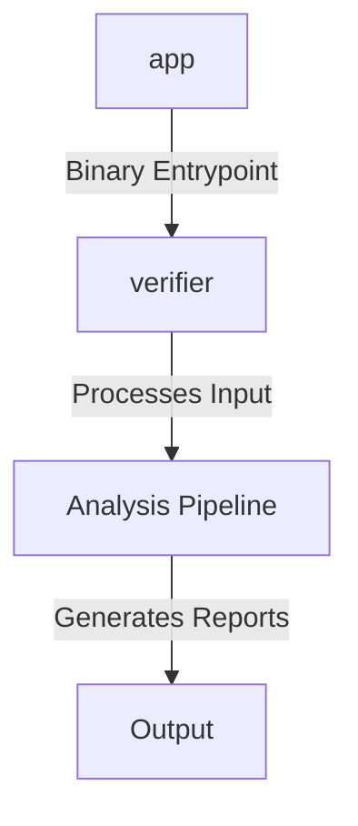

```markdown
# Verifier Architecture Document

## 1. System Overview

The Verifier system is a Go-based command-line interface (CLI) tool designed to analyze a repository's test coverage against its specifications and implementation plans. It identifies gaps in test coverage, recommends appropriate test strategies, and outputs structured reports. The system is composed of multiple components, each serving a specific role in the analysis process.

## 2. Components

- **Component: app**
  - **Source File:** `internal/repo/testdata/sample/cmd/app/main.go`
  - **Purpose:** This component serves as a binary entry point for the application, likely responsible for initializing and executing the main logic of the Verifier tool.

- **Component: verifier**
  - **Source File:** `cmd/verifier/main.go`
  - **Purpose:** This component acts as the primary binary entry point for the Verifier CLI tool, handling command-line arguments and orchestrating the execution of the analysis pipeline.

## 3. Data Flow

Based on the available information, the Verifier system does not expose any API endpoints or interact with external datastores. The data flow is primarily internal, where the CLI tool processes input files (such as specifications and plans) and source code to generate analysis reports. The flow involves reading these inputs, performing static analysis, and outputting results in human-readable and machine-readable formats.

## 4. External Dependencies

The fact model does not list any external integrations or datastores. The system appears to operate independently, relying solely on local files and internal processing.

## 5. Trust Boundaries

The fact model does not provide specific details on authentication patterns or trust boundaries. However, as a CLI tool, Verifier likely operates within the trust boundary of the local machine, assuming that the user has appropriate permissions to access the necessary files and directories.

## 6. Component Diagram



This diagram illustrates the relationship between the components, where the `app` and `verifier` components serve as entry points to the system, leading to the execution of the analysis pipeline and the generation of reports.
```
